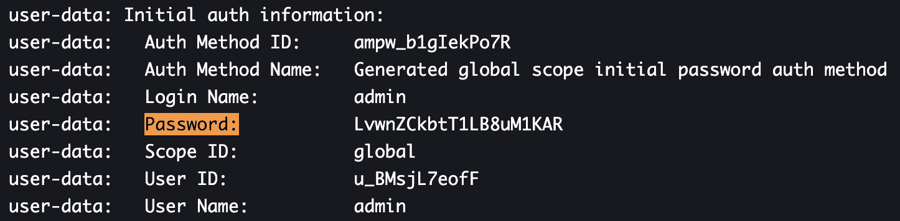

# Boundary demonstration

This repository is dedicated to demonstration purpose for boundary.

**Disclaimer**: The repository is here for demonstration purpose. Meaning: No best practice and a lot of review.

For the demonstration, we will based on AWS deployment EC2 single node.

## How is it working?

This our boundary stack. Take a look below to have more information on the Terraform stack.

## Run it

Run this command : `$ terraform apply`

When your terraform stack is deploy, do the following steps:

1. Get the `boundary endpoint`: Go to the Terraform output and grab the `boundary_endpoint`. This is the endpoint to our Boundary. You can also retrieve this output with the following Terraform command: `terraform output -raw boundary_endpoint`
2. Get the `boundary password`: Go to **AWS management console**, in the **EC2** service, select your **EC2 instance** (e.g. **boundary-dev**) then click on the button **Actions**-> **Monitor and troubleshoot**-> **Get system log**. Find for " **Password:** " and grab the password.

3. Put the URL into your web browser.
4. The username is `admin` and the password is the `boundary_password` you get in the **step 2**.

> The AWS system log take around 5min to be available.

Well done. You can now use Boundary.

If you want to try with a Postgresql target, follow the [README.md](./targets/README.md).

You can also test the [HashiCorp Learn - Boundary getting start](https://learn.hashicorp.com/tutorials/boundary/getting-started-console?in=boundary/getting-started).

## Clean it

Run this command : `$ terraform destroy`

## Contact

You see something wrong ? You want extra information or more ?

Contact me: <mehdi.laruelle@revolve.team>

<!-- BEGINNING OF PRE-COMMIT-TERRAFORM DOCS HOOK -->
## Requirements

| Name | Version |
|------|---------|
|  [terraform](#requirement\_terraform) | >= 1.0 |
|  [aws](#requirement\_aws) | ~> 3.50 |

## Providers

| Name | Version |
|------|---------|
|  [aws](#provider\_aws) | 3.63.0 |
|  [random](#provider\_random) | 3.1.0 |
|  [template](#provider\_template) | 2.2.0 |

## Modules

No modules.

## Resources

| Name | Type |
|------|------|
| [aws_autoscaling_group.instance](https://registry.terraform.io/providers/hashicorp/aws/latest/docs/resources/autoscaling_group) | resource |
| [aws_db_instance.boundary](https://registry.terraform.io/providers/hashicorp/aws/latest/docs/resources/db_instance) | resource |
| [aws_db_subnet_group.boundary](https://registry.terraform.io/providers/hashicorp/aws/latest/docs/resources/db_subnet_group) | resource |
| [aws_iam_instance_profile.session_manager](https://registry.terraform.io/providers/hashicorp/aws/latest/docs/resources/iam_instance_profile) | resource |
| [aws_iam_role.session_manager](https://registry.terraform.io/providers/hashicorp/aws/latest/docs/resources/iam_role) | resource |
| [aws_iam_role_policy.boundary](https://registry.terraform.io/providers/hashicorp/aws/latest/docs/resources/iam_role_policy) | resource |
| [aws_iam_role_policy_attachment.session_manager](https://registry.terraform.io/providers/hashicorp/aws/latest/docs/resources/iam_role_policy_attachment) | resource |
| [aws_internet_gateway.gw](https://registry.terraform.io/providers/hashicorp/aws/latest/docs/resources/internet_gateway) | resource |
| [aws_kms_key.recovery](https://registry.terraform.io/providers/hashicorp/aws/latest/docs/resources/kms_key) | resource |
| [aws_kms_key.root](https://registry.terraform.io/providers/hashicorp/aws/latest/docs/resources/kms_key) | resource |
| [aws_kms_key.worker](https://registry.terraform.io/providers/hashicorp/aws/latest/docs/resources/kms_key) | resource |
| [aws_launch_template.instance](https://registry.terraform.io/providers/hashicorp/aws/latest/docs/resources/launch_template) | resource |
| [aws_route_table.public](https://registry.terraform.io/providers/hashicorp/aws/latest/docs/resources/route_table) | resource |
| [aws_route_table_association.public](https://registry.terraform.io/providers/hashicorp/aws/latest/docs/resources/route_table_association) | resource |
| [aws_security_group.db](https://registry.terraform.io/providers/hashicorp/aws/latest/docs/resources/security_group) | resource |
| [aws_security_group.instance](https://registry.terraform.io/providers/hashicorp/aws/latest/docs/resources/security_group) | resource |
| [aws_security_group_rule.allow_controller_sg](https://registry.terraform.io/providers/hashicorp/aws/latest/docs/resources/security_group_rule) | resource |
| [aws_subnet.private](https://registry.terraform.io/providers/hashicorp/aws/latest/docs/resources/subnet) | resource |
| [aws_subnet.public](https://registry.terraform.io/providers/hashicorp/aws/latest/docs/resources/subnet) | resource |
| [aws_vpc.boundary](https://registry.terraform.io/providers/hashicorp/aws/latest/docs/resources/vpc) | resource |
| [random_password.db_master_pass](https://registry.terraform.io/providers/hashicorp/random/latest/docs/resources/password) | resource |
| [aws_ami.amazon_latest](https://registry.terraform.io/providers/hashicorp/aws/latest/docs/data-sources/ami) | data source |
| [aws_availability_zones.available](https://registry.terraform.io/providers/hashicorp/aws/latest/docs/data-sources/availability_zones) | data source |
| [aws_iam_policy_document.instance-assume-role-policy](https://registry.terraform.io/providers/hashicorp/aws/latest/docs/data-sources/iam_policy_document) | data source |
| [aws_instance.boundary](https://registry.terraform.io/providers/hashicorp/aws/latest/docs/data-sources/instance) | data source |
| [template_file.boundary_install](https://registry.terraform.io/providers/hashicorp/template/latest/docs/data-sources/file) | data source |

## Inputs

| Name | Description | Type | Default | Required |
|------|-------------|------|---------|:--------:|
|  [app](#input\_app) | Your application name. | `string` | `"boundary"` | no |
|  [db\_instance\_class](#input\_db\_instance\_class) | The database instance size & type. | `string` | `"db.t2.micro"` | no |
|  [db\_name](#input\_db\_name) | The database name. | `string` | `"boundary"` | no |
|  [db\_storage](#input\_db\_storage) | The database storage in GB. | `number` | `20` | no |
|  [db\_username](#input\_db\_username) | The admin username for the database. | `string` | `"boundary"` | no |
|  [env](#input\_env) | Environment variable for the application. | `string` | `"dev"` | no |
|  [instance\_type](#input\_instance\_type) | The EC2 instance size and type. | `string` | `"t3.small"` | no |
|  [owner](#input\_owner) | The owner of the application or the owner of the deployed stack. | `string` | `"Terraform"` | no |
|  [region](#input\_region) | n/a | `string` | `"eu-west-1"` | no |
|  [vpc\_cidr](#input\_vpc\_cidr) | The CIDR to use for the VPC. | `string` | `"10.0.0.0/16"` | no |

## Outputs

| Name | Description |
|------|-------------|
|  [ami\_version\_id](#output\_ami\_version\_id) | n/a |
|  [boundary\_endpoint](#output\_boundary\_endpoint) | n/a |
|  [subnets\_private](#output\_subnets\_private) | n/a |
|  [vpc\_id](#output\_vpc\_id) | n/a |
<!-- END OF PRE-COMMIT-TERRAFORM DOCS HOOK -->

